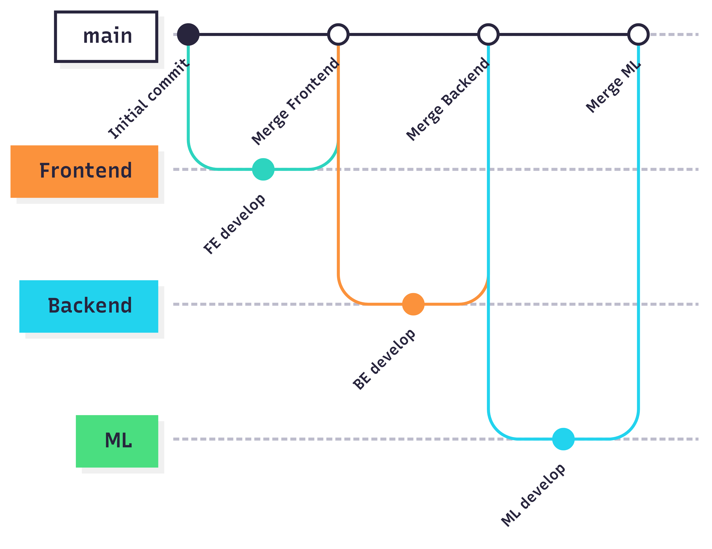

## Сontributing
### Kanban Board
The project uses a GitLab issue board with five columns: Open, ML, Frontend, Backend, and Closed. The ML, Frontend, and Backend columns are label-based lists: they automatically include any open issue tagged with ML, Frontend, or Backend, respectively.
[Kanban Board](https://gitlab.pg.innopolis.university/megacrutieprogrammersey/pinkycode/-/boards)

#### Entry criteria
- **Open**: new issues start here. Each issue must be created using issue template, assigned an estimate (story points), and given an initial label, priority. The issue should be labeled (or left unlabeled if undecided) and possibly assigned, but it remains in Open until work begins.
- **Frontend**: labeled "Frontend" and assigned to a frontend developer. It must have UI/UX requirements, acceptance criteria, and an estimate (in story points). Once ready for coding, the issue is moved into Frontend.
- **Backend**: labeled "Backend" and assigned to a backend developer. The issue should include task description, acceptance criteria, and an estimate (in story point). When is ready for implementation, move it into Backend.
- **ML**: tagged "ML" and assigned to an ML team member. It should include any needed data/model details, clear acceptance criteria, and an estimate (in story point). Only issues ready for ML implementation, they are moved into ML.
- **Closed**: the issue is resolved. This means its merge request has been reviewed, approved, and merged into main (and associated CI tests have passed). After merging, the issue is marked closed in GitLab and it appears in Closed.

### Git Workflow Process description

The GitLab workflow with four main branches: main, Frontend, Backend, and ML. The main branch holds stable code (only updated via merge requests from team branches). The Frontend, Backend, and ML branches serve as integration branches for UI, server/API, and ML work. Key rules and conventions

**Frontend** branches' commits will have the following message format:

```
Created/Edited/Removed [FILENAME] ...
Added [OBJECT] for the [PAGE] ...
Improved/Fixed the format of the [OBJECT] in the [PAGE] ...
```
**Backend** branches' commits will have the following message format:
```
Created/Edited/Removed [FILENAME] ...
Set/Implemented the functionality of [OBJECT] ...
Set up/Configured/Fixed the database [DBNAME] ...
Fixed [METRIC] ...
Fixed [FEATURE]
```

**ML** branches' commits will have the following message format:
```
Created/Edited/Removed [FILENAME] ...
Improved/Changed/Fixed prompt ...
The logic of [METRIC] assessment was changed/improved/polished/fixed ...
Changed the model from [LLM1] to [LLM2] ...
```
- **Creating issues**: All new issues must use one of the provided [issue templates](#issue-form-templates).
- **Labelling issues**: Label each issue by Frontend, Backend, ML, so it appears in the correct board column. Assign it to the developer or team who will work on it. Use other labels as needed for priority or milestones.
- **Branch creation**: For each issue, create a new feature branch off the corresponding team branch. Name branches descriptively, e.g. backend/db-refactor. 
- **Merge Requests**: Use the project’s [MR template](#merge-request-template) for each MR. 
- **Code review**: Each MR requires review and approval by at least one other team member before merging. Reviewers should check correctness, code style, test coverage.

### Secrets management
Sensitive keys (OpenAI, Groq API key) are never checked into code or stored in the repository. Instead, we store them as environment variables in server provider.

## Issue form templates
The following templates are available:

- for **Epic** issues:
    - [User Story](ISSUE_TEMPLATE/epic-user-story.yml)
    - [Bug Report](ISSUE_TEMPLATE/epic-bug-report.yml)
    - [Technical Task](ISSUE_TEMPLATE/epic-technical-task.yml)
- for **Backlog** issues:
    - [User Story](ISSUE_TEMPLATE/backlog-user-story.yml)
    - [Bug Report](ISSUE_TEMPLATE/backlog-bug-report.yml)
    - [Technical Task](ISSUE_TEMPLATE/backlog-technical-task.yml)
- for **Task** issues:
    - [User Story](ISSUE_TEMPLATE/task-user-story.yml)
    - [Bug Report](ISSUE_TEMPLATE/task-bug-report.yml)
    - [Technical Task](ISSUE_TEMPLATE/task-technical-task.yml)

## Merge Request Template

#### Related Issue  
Link the issue this MR addresses.

#### Summary of Changes  
Describe what you’ve changed in this MR.

#### Motivation & Context  
Why are we making these changes? What problem does this solve?

#### How to Test  
Describe in detail how a reviewer can verify your changes.

#### Checklist  
- [ ] Related issue is linked in **Related Issue** above.
- [ ] Code follows the project’s style guidelines. 
- [ ] Tests have been added/updated. 
- [ ] Pipeline passes successfully. 
- [ ] Documentation has been updated if needed.