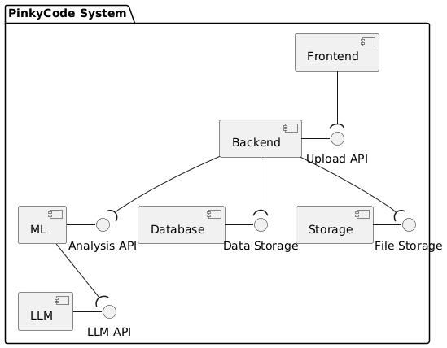
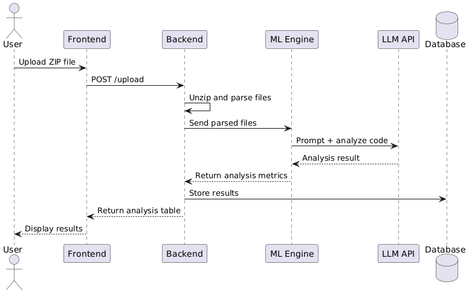
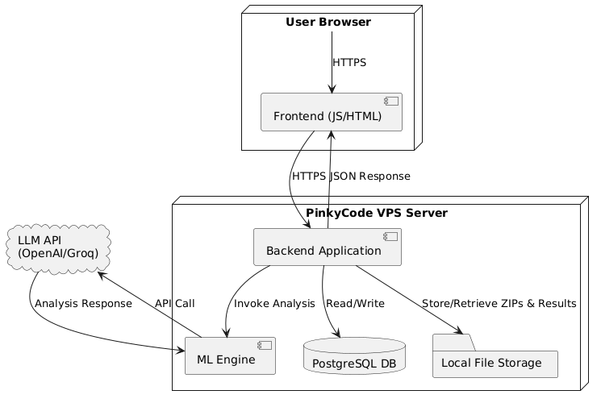

# PinkyCode 


PinkyCode is a web-based tool for code comments assessment.

It allows you to upload a **.zip** archive of files with codes as contents
and allows to configure the grading criteria in accordance with your preferences.

As a result you get the table with assessment of
comments **density**, number of **commented methods**, **readability** score, **meaningless** score, and the list of **issues** for each file of the uploaded archive.

The gained table can be downloaded directly from the page.

Each table is stored in the history of your account for 1 month.

#### Link
https://pinkycode.mooo.com/

#### Demonstration


## Goal/Description 

#### Goal:
To provide educators with a fast, consistent, and customizable way to assess code comments in students’ programming assignments.

#### Description:
PinkyCode is a web-based tool that helps teachers evaluate the quality of comments in code. Users can upload a .zip archive containing code files and configure grading criteria based on their preferences. The platform analyzes each file and generates a downloadable table with metrics such as comment density, number of commented methods, readability score, and potential issues. All assessments are stored in the user's account history for 1 month.

## Usage
From main page use [credentials](#Credentials) to authenticate. You can upload only .zip files. From main page you can access admin page where you can add new users and see history of assessment results.
#### Credentials:
System saves login and password in cookies, so no authentification after reloading page is needed.
- login: admin@mail.com
- password: admin

## Connection to the repository

### Option 1: Fresh Clone (recommended)

```bash
git clone https://gitlab.pg.innopolis.university/megacrutieprogrammersey/pinkycode.git
cd pinkycode
```

### Option 2: Connect Existing Local Repo

```
cd existing_repo
git remote add origin https://gitlab.pg.innopolis.university/megacrutieprogrammersey/pinkycode.git
git branch -M main
git push -uf origin main
```
***

## Development
### Kanban Board
The project uses a GitLab issue board with five columns: Open, ML, Frontend, Backend, and Closed. The ML, Frontend, and Backend columns are label-based lists: they automatically include any open issue tagged with ML, Frontend, or Backend, respectively.
[Kanban Board](https://gitlab.pg.innopolis.university/megacrutieprogrammersey/pinkycode/-/boards)

#### Entry criteria
- **Open**: new issues start here. Each issue must be created using issue template, assigned an estimate (story points), and given an initial label, priority. The issue should be labeled (or left unlabeled if undecided) and possibly assigned, but it remains in Open until work begins.
- **Frontend**: labeled "Frontend" and assigned to a frontend developer. It must have UI/UX requirements, acceptance criteria, and an estimate (in story points). Once ready for coding, the issue is moved into Frontend.
- **Backend**: labeled "Backend" and assigned to a backend developer. The issue should include task description, acceptance criteria, and an estimate (in story point). When is ready for implementation, move it into Backend.
- **ML**: tagged "ML" and assigned to an ML team member. It should include any needed data/model details, clear acceptance criteria, and an estimate (in story point). Only issues ready for ML implementation, they are moved into ML.
- **Closed**: the issue is resolved. This means its merge request has been reviewed, approved, and merged into main (and associated CI tests have passed). After merging, the issue is marked closed in GitLab and it appears in Closed.

### Git Workflow Process description

The GitLab workflow with four main branches: main, Frontend, Backend, and ML. The main branch holds stable code (only updated via merge requests from team branches). The Frontend, Backend, and ML branches serve as integration branches for UI, server/API, and ML work. Key rules and conventions

**Frontend** branches' commits will have the following message format:

```
Created/Edited/Removed [FILENAME] ...
Added [OBJECT] for the [PAGE] ...
Improved/Fixed the format of the [OBJECT] in the [PAGE] ...
```
**Backend** branches' commits will have the following message format:
```
Created/Edited/Removed [FILENAME] ...
Set/Implemented the functionality of [OBJECT] ...
Set up/Configured/Fixed the database [DBNAME] ...
Fixed [METRIC] ...
Fixed [FEATURE]
```

**ML** branches' commits will have the following message format:
```
Created/Edited/Removed [FILENAME] ...
Improved/Changed/Fixed prompt ...
The logic of [METRIC] assessment was changed/improved/polished/fixed ...
Changed the model from [LLM1] to [LLM2] ...
```
- **Creating issues**: All new issues must use one of the provided [issue templates](#issue-form-templates).
- **Labelling issues**: Label each issue by Frontend, Backend, ML, so it appears in the correct board column. Assign it to the developer or team who will work on it. Use other labels as needed for priority or milestones.
- **Branch creation**: For each issue, create a new feature branch off the corresponding team branch. Name branches descriptively, e.g. backend/db-refactor. 
- **Merge Requests**: Use the project’s [MR template](#merge-request-template) for each MR. 
- **Code review**: Each MR requires review and approval by at least one other team member before merging. Reviewers should check correctness, code style, test coverage.

### Secrets management
Sensitive keys (OpenAI, Groq API key) are never checked into code or stored in the repository. Instead, we store them as environment variables in server provider.

## Issue form templates
The following templates are available:

- for **Epic** issues:
    - [User Story](ISSUE_TEMPLATE/epic-user-story.yml)
    - [Bug Report](ISSUE_TEMPLATE/epic-bug-report.yml)
    - [Technical Task](ISSUE_TEMPLATE/epic-technical-task.yml)
- for **Backlog** issues:
    - [User Story](ISSUE_TEMPLATE/backlog-user-story.yml)
    - [Bug Report](ISSUE_TEMPLATE/backlog-bug-report.yml)
    - [Technical Task](ISSUE_TEMPLATE/backlog-technical-task.yml)
- for **Task** issues:
    - [User Story](ISSUE_TEMPLATE/task-user-story.yml)
    - [Bug Report](ISSUE_TEMPLATE/task-bug-report.yml)
    - [Technical Task](ISSUE_TEMPLATE/task-technical-task.yml)

## Merge Request Template

#### Related Issue  
Link the issue this MR addresses.

#### Summary of Changes  
Describe what you’ve changed in this MR.

#### Motivation & Context  
Why are we making these changes? What problem does this solve?

#### How to Test  
Describe in detail how a reviewer can verify your changes.

#### Checklist  
- [ ] Related issue is linked in **Related Issue** above.
- [ ] Code follows the project’s style guidelines. 
- [ ] Tests have been added/updated. 
- [ ] Pipeline passes successfully. 
- [ ] Documentation has been updated if needed.

## Architecture

### Static view
- **Maintainability**: We have modular design. This is helpful, since for example developer can modify or replace the ML analysis logic without impacting the frontend. Reusability is improved since each component could be reused in other projects. Testing is also easier, as individual components can be unit-tested in isolation.
- **Cohesion and Coupling**: Each component (frontend, backend, ML) encapsulates related functionality (high cohesion), and they communicate via API calls rather than shared state (low coupling).

### Dynamic view
In worst case .zip file with 20 code samples takes around 30 seconds.


### Deployment view
In production, PinkyCode runs on a single Virtual Private Server (VPS).



#### **Legend:**
- **User Browser**: Runs the single‑page frontend.
- **PinkyCode VPS Server**: A VPS hosting both the backend and ML services.
    - **Backend Application**: Handles uploads, unpacks ZIPs, coordinates analysis, and serves API endpoints.

    - **ML Engine**: Executes code‑comment analysis logic, including calls to the external LLM.

    - **PostgreSQL DB**: Stores user histories, assessment tables.

    - **Local File Storage**: contains uploaded ZIP files and generated reports.

- **LLM API**: External large‑language‑model (OpenAI or Groq) called by the ML Engine.

## Build and deployment
### Continuous Integration
We use GitLab CI for continuous integration. The pipeline is defined in the [.gitlab-ci.yml](/.gitlab-ci.yml) file at the repository root, which specifies stages and jobs to run.

#### Static Analysis Tools
We use **Pylint**, because it has the widest range of checks (syntax, PEP8, logic, types check, and docstrings check). It can be easily integrated with CI/CD pipeline for code checking before merging.

#### Testing Tools
- For unit tests we used the built-in Python library unittest because of its simplicity and small number of external dependencies, which reduces the risk of dependency conflicts.
- For integration tests we used Python library pytest, because there is no need to write a lot of boilerplate code like in unittest, and it allows us to easily set up an interaction with external systems such as databases, API or file systems.

[CI workflow runs](https://gitlab.pg.innopolis.university/megacrutieprogrammersey/pinkycode/-/pipelines)

### Continuous Deployment
No CD pipeline is configured for this project at this time (only continuous integration is used).

## Quality assurance
### Quality attribute scenarios
[Link to quality attribute scenarios](docs/quality-assurance/quality-attribute-scenarios.md)
### Automated tests
For tests we ised **pylint**, **pytest** and **unittest**. We implemented unit tests in **unittests** directory ([link](/unittests)) and integration tests in integration_test directory ([link](/integration_tests))

## Authors and acknowledgment
**Saida Musaeva** (Front-end developer)<br>
**Anna Mingaleva** (Front-end developer)<br>
**Taisiia Orshulskaia** (Back-end developer)<br>
**Aksiniia Miasoedova** (Back-end developer)<br>
**Maxim Iziumov** (ML)<br>
**Zamir Safin** (ML)<br>

## Project status
On active process...
